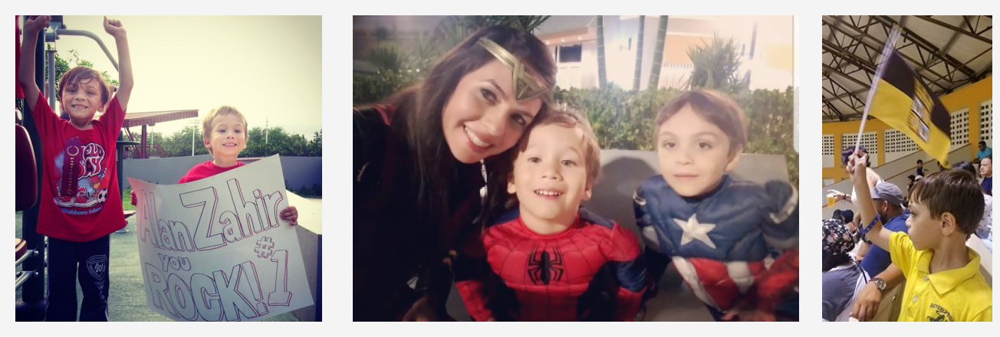

```{r, echo = FALSE, warning = FALSE, message = FALSE}
library(knitr)
library(magick)
"print.magick-image" <- function(x, ...){
  ext <- ifelse(length(x), tolower(image_info(x[1])$format), "gif")
  tmp <- tempfile(fileext = paste0(".", ext))
  image_write(x, path = tmp)
  knitr::include_graphics(tmp)
}
```

```{r setup, include=FALSE}
knitr::opts_chunk$set(echo = TRUE)
```

#data journalism + coding + information design
Hello! I am a Puerto Rican-Yaucana- journalist with a passion for hyperlocal reporting, data analysis, coding, and information design. 

#Choosing my path 
Participating in the Digital Methods Summer School 2016 in Amsterdam, where I met new media researchers Lilliana Bounegru and Jonathan Gray, made me realize that data literacy is crucial to comprehend, account for, intervene around and participate in the wider socio-technical infrastructures. At that moment I felt that I had been living in the dark, even after almost finishing my master's degree in journalism at my native Puerto Rico. I came back to my island determined to learn on my own how to become a data journalist. I watch hundreds of tutorials and practice with tableau.  I tried to implement my learning to the articles I wrote for a small local newspaper I worked for at the time. However, there was no higher support for it. Then hurricane Maria happened, and I reaffirmed myself that if local journalist had deeper computational skills, they would have been able to conduct analysis that were mainly done by mainland media outlets just in English language. For this reason, my frustration grew stronger, and I decided to turn my life around and moved to New York City in December 2017. I got enrolled at Hackers USA and finished two IT classes. Then I was accepted in the Lede 24 Program of Columbia's Journalism School where I fortified my data analysis, visualizing and programing skills until last December (2018). 

#Facts
???.After I started graduate school in Puerto Rico back in 2016, I acknowledge that in order to become a contemporary journalist, I should learn new skills that were not part of a traditional journalist's resume just a few years ago.
???.This is the reason why on December 2017 I moved to the United States continental and last December I completed the <a href="http://ledeprogram.com/" target="_blank">Lede 24 Program</a> of Columbia's Graduate School of Journalism in the City of New York. 
???.Raw data talks about human beings and my goal is to continue being an interpreter for the world citizens. ???.Before I used to be a full-time journalist at <a href="http://www.periodicolaperla.com/?s=coral+negron" target="_blank">La Perla del Sur</a>. 
???.Spanish is my native language. Also, English, Portuguese, and Italian are part of me. 
???.My abuela's "domplines" are the best.
???.I am the mother of two wonderful boys. 

```{r,  echo = FALSE, message = FALSE, fig.align = "center", out.width = "90%"}
aerial <- image_read("images/Alanyaaron.jpg") %>% 
  image_scale("400") %>% 
  image_scale("x400") %>% 
  image_border("#f4f4f4", "20x20")
Sherlock_2 <- image_read("images/Yauco.jpg") %>% 
  image_scale("400") %>% 
  image_scale("x400") %>% 
  image_border("#f4f4f4", "10x20")
Parker <- image_read("images/Superheroes.jpg") %>% 
  image_scale("400") %>% 
  image_scale("x400") %>% 
  image_border("#f4f4f4", "20x20")
photos <- c(aerial, Parker, Sherlock_2)
allPhotos <- image_append(photos)
image_write(allPhotos, path = "images/all_Photos.png",format = "png")

```